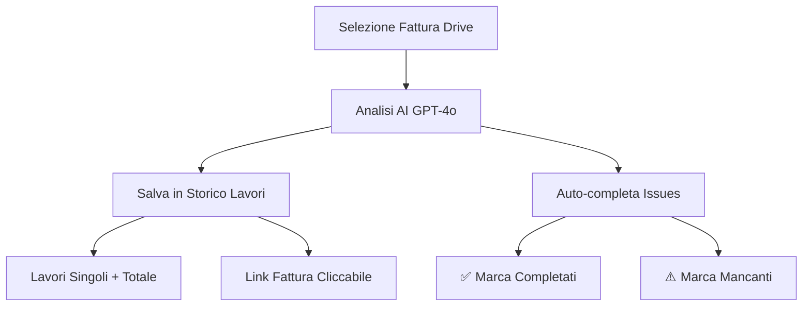

# ✅ Sistema Analisi Fatture - COMPLETO

## 🎯 Cosa Fa il Sistema

Quando selezioni una fattura (immagine o PDF) da Google Drive:

1. **📸 Analizza con AI** - OpenAI GPT-4o legge la fattura
2. **💾 Salva in "Storico Lavori"** - Ogni lavoro elencato singolarmente
3. **✅ Chiude automaticamente** i problemi da "Difetti e Riparazioni" se completati
4. **⚠️ Marca lavori mancanti** se preventivati ma non fatti
5. **💰 Salva totale fattura** come riga riepilogo

---

## 📊 Sheet "Storico Lavori" (Creato Automaticamente)

### Colonne:
| Colonna | Descrizione |
|---------|-------------|
| **Data Lavoro** | Data della fattura |
| **ID Veicolo** | Identificativo veicolo (es: N1) |
| **Nome Veicolo** | Nome completo veicolo |
| **Tipo Lavoro** | ✅ Completato / ➕ Extra |
| **Descrizione** | Descrizione dettagliata lavoro |
| **Costo CHF** | Costo singolo (se disponibile) |
| **Officina** | Nome officina/garage |
| **N° Fattura** | Numero fattura |
| **ID Lista** | Collegamento a Lista Officina |
| **Link Fattura** | Link cliccabile a foto/PDF |
| **Note** | Note aggiuntive |

### Tipi di Lavori:
- **✅ Completato** (sfondo verde) - Lavori preventivati e completati
- **➕ Extra** (sfondo giallo) - Lavori aggiuntivi non preventivati
- **💰 TOTALE FATTURA** (sfondo arancione, grassetto) - Riga riepilogo

---

## 🔄 Workflow Automatico



---

## 📋 Esempio Risultato

### Dopo analisi di una fattura:

**Storico Lavori:**
```
Data       | Veicolo | Tipo          | Descrizione                    | Costo | Fattura | Link
-----------|---------|---------------|--------------------------------|-------|---------|------
2025-06-30 | N1      | ✅ Completato | Cambio olio motore            |       | 250254  | 📄 Vedi
2025-06-30 | N1      | ✅ Completato | Sostituzione filtro olio      |       | 250254  | 📄 Vedi
2025-06-30 | N1      | ➕ Extra      | Servizio annuale              |       | 250254  | 📄 Vedi
2025-06-30 | N1      | ➕ Extra      | Filtro carburante             |       | 250254  | 📄 Vedi
2025-06-30 | N1      | 💰 TOTALE     | 19 lavori effettuati          | 874.79| 250254  | 📄 Vedi
```

**Difetti e Riparazioni:**
- ✅ "Cambio olio motore" → Completato automaticamente
- ✅ "Sostituzione filtro olio" → Completato automaticamente
- ⚠️ "Controllo freni" → Aggiunto "⚠️ NON FATTO - Verificare con officina"

---

## 🚀 Come Usare

1. Vai alla sezione **"Liste Officina"**
2. Trova la lista del veicolo
3. Clicca **"📁 Seleziona da Drive"**
4. Scegli la fattura (immagine o PDF)
5. Attendi analisi AI (30-60 secondi)
6. **Automaticamente:**
   - ✅ Lavori salvati in "Storico Lavori"
   - ✅ Issues completati marcati
   - ⚠️ Lavori mancanti evidenziati

---

## 🔧 Funzioni Backend Aggiunte

### `saveInvoiceToHistory(listId, analysisData, photoUrl)`
Salva tutti i lavori della fattura in "Storico Lavori":
- Crea sheet se non esiste
- Salva ogni lavoro singolarmente
- Aggiunge riga totale
- Link cliccabile alla fattura

### `autoCompleteIssuesFromInvoice(listId, analysisData)`
Aggiorna automaticamente "Difetti e Riparazioni":
- Trova issues correlate alla lista
- Marca come completati se presenti in fattura
- Aggiunge warning se preventivati ma non fatti
- Aggiorna date e stati

---

## 📊 Statistiche Automatiche

Dalla sheet "Storico Lavori" puoi facilmente:
- **Filtrar per veicolo** - Storico completo ogni veicolo
- **Filtrar per data** - Lavori in un periodo
- **Sommare costi** - Spese totali per veicolo
- **Confrontare officine** - Chi fa cosa
- **Vedere pattern** - Lavori frequenti

---

## ✅ Deployment

### Backend (Google Apps Script):
```
1. Copia complete-secure-script-with-maintenance.gs
2. Incolla nel tuo Google Apps Script
3. Salva (Ctrl+S)
4. Deploy → Nuova versione → Deploy
```

### Frontend (App):
```
1. File maintenance-new.html già aggiornato
2. Ricarica app (Ctrl+F5)
3. Pronto all'uso!
```

---

## 🎉 Vantaggi

✅ **Zero lavoro manuale** - Tutto automatico dopo analisi
✅ **Tracciabilità completa** - Ogni lavoro registrato
✅ **Chiusura automatica** - Issues completati senza cliccare
✅ **Alert lavori mancanti** - Sai subito cosa non è stato fatto
✅ **Link diretto fattura** - Clicca e vedi documento
✅ **Storico per veicolo** - Sapere esattamente cosa è stato fatto
✅ **Analisi costi** - Monitorare spese nel tempo

---

## 📈 Prossimi Sviluppi Possibili

- 📊 **Dashboard costi** per veicolo
- 📅 **Promemoria tagliandi** basati su storico
- 💡 **Suggerimenti AI** su manutenzione preventiva
- 📧 **Report automatici** mensili/trimestrali
- 🔔 **Alert spese anomale** oltre media

---

**🎯 PRONTO ALL'USO!**

Fai il deploy del backend e prova con una fattura reale! 🚀
